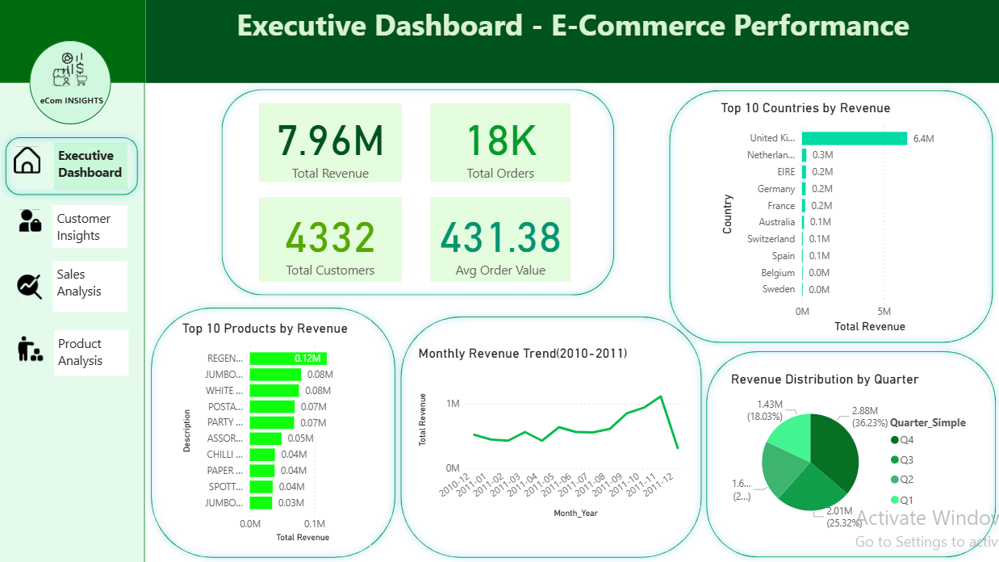
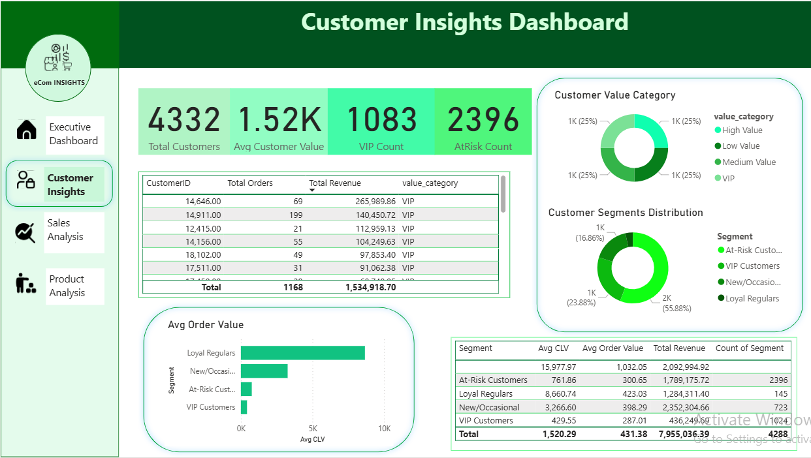
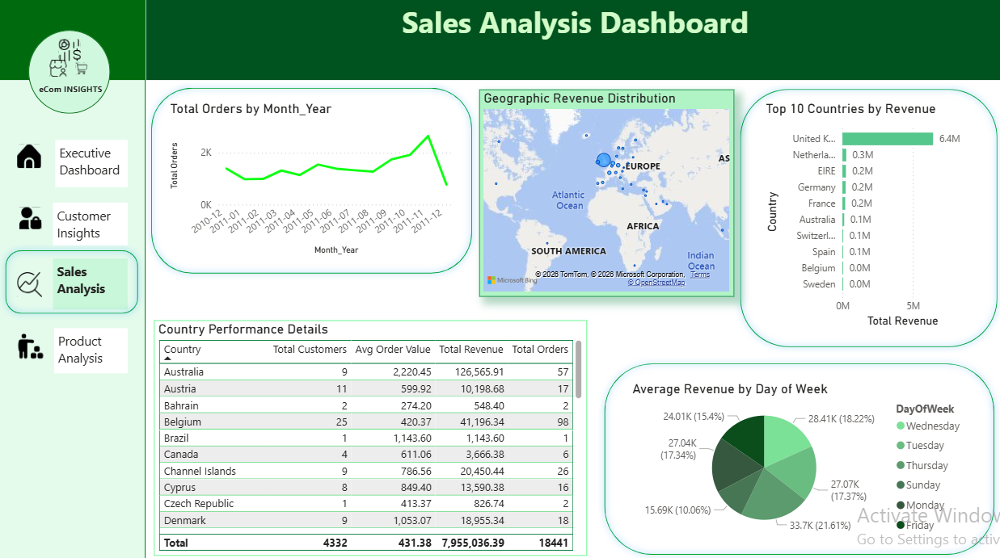
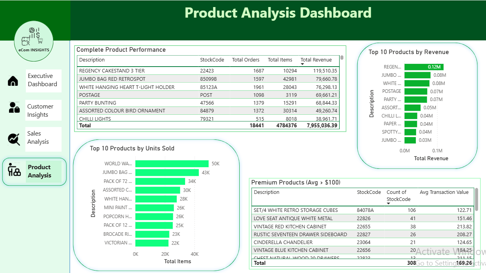

# 🛒 E-Commerce Customer Intelligence Platform

An end-to-end data science project analyzing 500K+ transactions to segment customers, predict Customer Lifetime Value (CLV), and provide actionable insights through interactive dashboards and a live API.

## 🎯 Business Problem

The e-commerce company has a large number of transactions but lacks insights on:
- Who are the most valuable customers?
- Which customers are at risk of leaving?
- How much each customer is likely to spend in the future?

Without this knowledge, marketing campaigns are inefficient and revenue is at risk.

## ✅ Solution

We built an **AI-powered Customer Intelligence Platform** that:
- Segments customers using **K-Means clustering**
- Predicts **Customer Lifetime Value (CLV)** with **95% accuracy** using Random Forest
- Provides actionable insights through **Power BI dashboards**
- Serves predictions via a **FastAPI REST API**

## 📊 Key Results

- **Total Revenue Analyzed:** £7.95M  
- **Customers Analyzed:** 4,332  
- **Customer Segments:** 4 (At-Risk, VIP, Loyal, New/Occasional)  
- **CLV Model Accuracy:** 95.3%  
- **At-Risk Revenue:** £1.82M  
- **Top Customer Value:** £16,388  

## 📊 Power BI Dashboards

### Executive Dashboard
Shows KPIs, monthly revenue, and top products.  

### Customer Insights
Visualizes customer segments, top customers, and value categories.  

### Sales Analysis
Monthly orders, country-wise revenue, and weekday analysis.  

### Product Analysis
Top products by revenue and quantity, premium product analysis.  

## 🧠 Insights

- 55.9% of customers are at-risk (recoverable revenue of £1.82M)  
- Loyal Regulars (3.4% of customers) generate 47% of total revenue  
- Thursday is the highest sales day (£33.7K average)  
- Netherlands & Australia have the highest average order value (£100+)  

## 🚀 Live Demo & API

- **API Documentation:** [Live FastAPI on Hugging Face](https://huggingface.co/spaces/SamadhiDBS/ecommerce-customer-api)  
- Predict Customer Segment and CLV using the API endpoints

## 🛠️ Technologies Used

- **Data Processing & ML:** Python, Pandas, NumPy, Scikit-learn  
- **Visualization:** Power BI  
- **Backend API:** FastAPI, Uvicorn  
- **Database:** PostgreSQL  
- **Deployment:** Docker, Hugging Face Spaces  

## 👤 Author

**Your Name**  
- GitHub: https://github.com/SamadhiDBS 
- LinkedIn: https://www.linkedin.com/in/sithumi-samadhi-0746b6292

## 📄 License

MIT License
